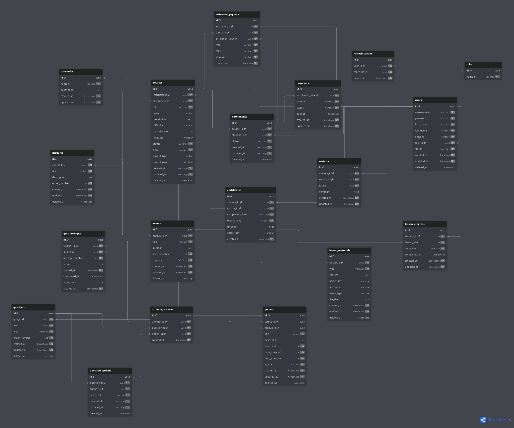

# Learning Management System (LMS)

A Learning Management System for managing courses, students, instructors, quizzes, certificates, enrollments, and platform finances.

## Project Overview

This project is designed to provide an online learning platform where:

* **SuperAdmins** can manage users, courses, roles, and platform finances.
* **Instructors** can create and manage their own courses, modules, lessons, and quizzes.
* **Students** can enroll in courses, complete lessons, take quizzes, receive certificates, and leave reviews.

## Current Status

🚧 **System Design / Database Design**

The system architecture and database structure have been designed using **DBML** and **dbdiagram.io**.

### Database Design

The current database model includes:

* Users & Roles
* Courses & Categories
* Modules & Lessons
* Lesson Materials
* Enrollments & Payments
* Instructor Payouts
* Lesson Progress
* Quizzes & Questions
* Quiz Attempts & Answers
* Certificates
* Reviews

### ER Diagram



## System Architecture

The planned backend architecture follows a layered approach:

```text
Client
  ↓
Go REST API
  ↓
JWT Authentication
  ↓
Casbin Authorization
  ↓
Handler
  ↓
Service
  ↓
Repository
  ↓
PostgreSQL
```

Additional infrastructure:

* **Redis** — caching and temporary data
* **MinIO** — object storage for videos, files, images, and certificates

Detailed architecture documentation is available in [`docs/architecture.md`](docs/architecture.md).

## Tech Stack

* **Backend:** Go
* **Database:** PostgreSQL
* **Cache:** Redis
* **Object Storage:** MinIO
* **Authentication:** JWT + bcrypt
* **Authorization:** Casbin
