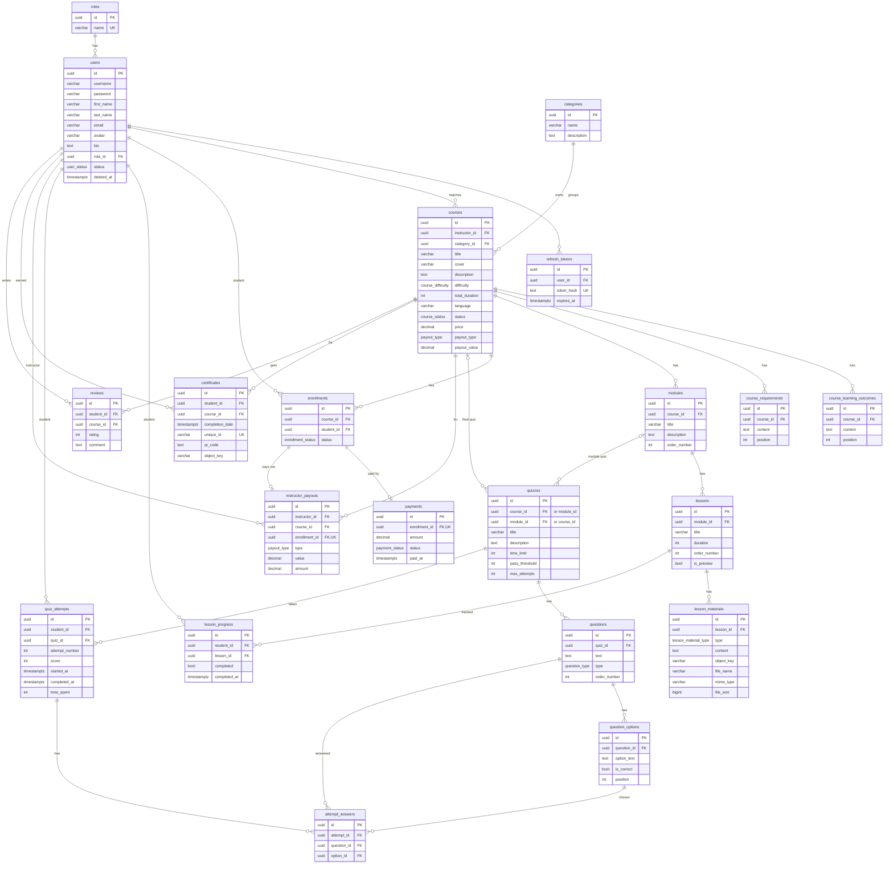

# Database ERD

Source of truth: `migrations/`. `deleted_at` columns (soft delete) are on users, categories, courses, modules, lessons, lesson_materials, enrollments, quizzes, questions and question_options.

Enums: `user_status` (active, blocked), `course_status` (draft, published), `course_difficulty` (beginner, intermediate, advanced), `payout_type` (percentage, fixed), `lesson_material_type` (text, video, file), `enrollment_status` (active, completed, dropped), `question_type` (single_choice, multiple_choice, true_false), `payment_status` (paid).

A quiz belongs to a course (final quiz) **or** a module, never both (CHECK). A review has a rating of 1-5. Payments and payouts are one-to-one with an enrollment.

Redis (not in the database): `password_reset:<hash>` (one-time reset token), `login_failures:<username>`, `forgot_password:<email>` and `rate:<name>:<ip>` (counters), `revoked_user:<id>` (the time the user's access tokens were ended; lives as long as an access token).  `cache:<scope>:v<N>:<key>` and `cache_version:<scope>` (cached catalog answers and their version).
